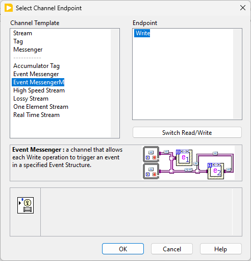
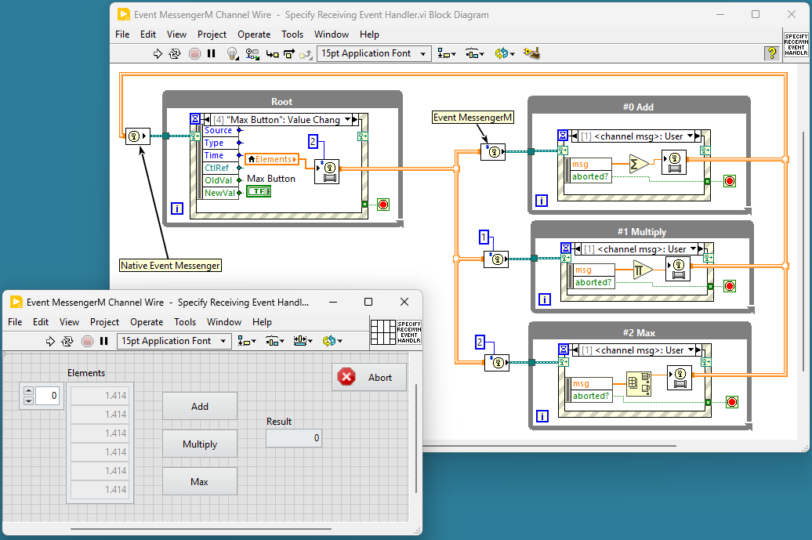
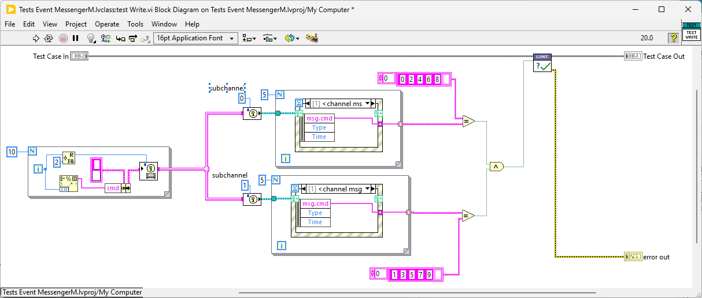
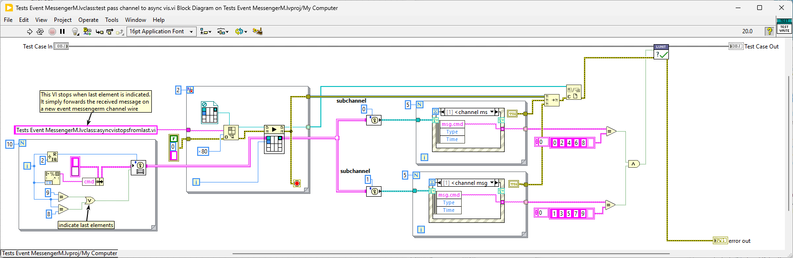
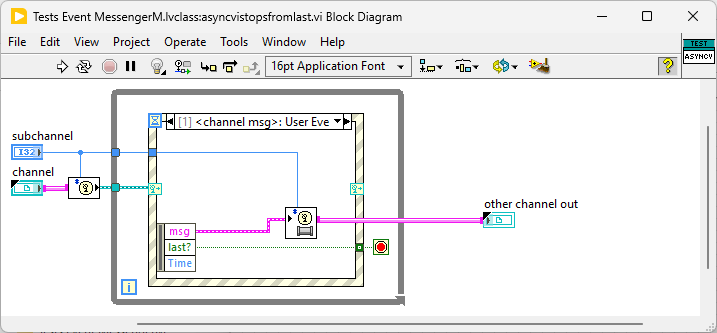

# Event MessengerM Channel Wire

This repository is inspired by [MessengerM Advanced Messenger Channel by Jeff Kodosky](https://github.com/vipm-io/message-multiplexer-channel-wire)

It provides a LabVIEW Event Messenger Channel Wire with Subchannels. This variant of the native Event Messenger Channel overcomes the limitation of not being able to add channel wires into arrays. It introduces a Subchannel input to the native `Write.vi` and `Read Event Registration.vi`.

---

## VIPM

The `vipm` folder contains a VIPM package with everything needed to use Event MessengerM Channel Wire.  

It creates an **Event MessengerM Channel Wire** entry under create channel endpoint menu.

## Example

## Intended Usage

